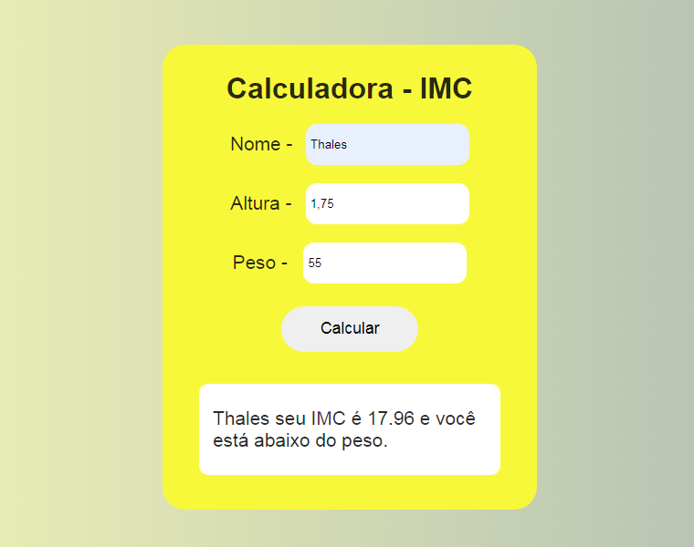

# IMC
Pagina feita com HTML, CSS e JS com o intuito de calcular o IMC (Índice de Massa Corporal) de uma pessoa e verificar sua condição.

##

O índice de massa corporal é calculado a partir do quadrado de sua altura dividido pelo peso

A partir do resultado exibido, compare com a tabela :

- Menor que 18.5 - Abaixo do peso

- Igual ou maior que 18.6 e Menor que 25 - Peso ideal

- Igual ou maior que 25.1 e Menor que 30 - Levemente acima do peso

- Igual ou maior que 30.1 e Menor que 35 - Obesidade grau 1

- Igual ou maior que 35.1 e Menor que 40 - Obesidade grau 2

- Maior que 40 - Obesidade grau 3

##

Imagens com exemplos:

